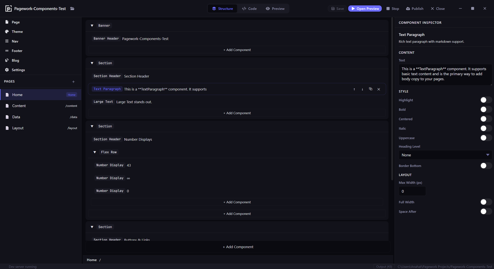
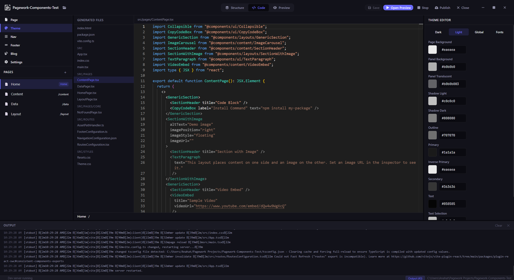
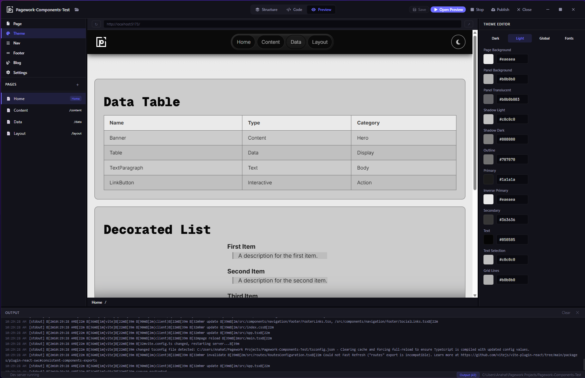
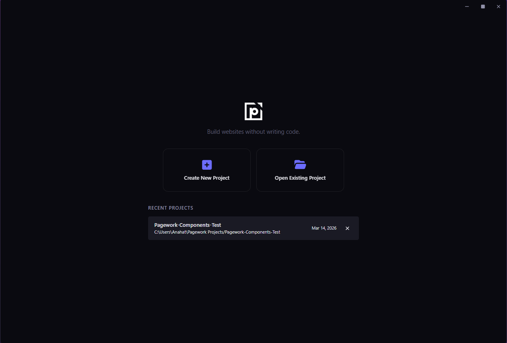

  

<h1 align="center">Pagework</h1>

  <strong>A manifest-driven desktop website builder that generates real React & Vite codebases — no coding required.</strong>

  
  
  
  
  
  
  

  <a href="https://anahatmudgal.com/projects/pagework">Project Page</a> •
  <a href="https://anahatmudgal.com">Author Website</a> •
  <a href="https://github.com/anahatm">GitHub</a>

---

> [!WARNING]
> Pagework is a **work-in-progress**. Most core features are functional, but some parts may not be working as expected. The project is under active development and will receive future updates — including AI-powered features. Expect breaking changes and rough edges.

---

## What is Pagework?

Pagework is a **local-first desktop application** that lets you visually build websites using a library of premade React components — without writing a single line of code. It generates a complete, production-ready **React, Vite, TypeScript** project directly on your computer.

Select a component, tweak its properties in a sidebar panel, and Pagework writes all the real source code for you, and add more components at the press of a button.

The output is a standard React app on your local computer, which you can customize further, and deploy anywhere such as Vercel, Netlify, GitHub Pages, or your own server.

---

## Screenshots

<table>
  <tr>
    <td></td>
    <td></td>
  </tr>
  <tr>
    <td></td>
    <td></td>
  </tr>
</table>

---

## Key Features

- **Manifest-Driven Architecture** — A single JSON file (`pagework.project.json`) is the source of truth. Every page, component, theme setting, and navigation item lives in the manifest. Code is generated from it, not the other way around.

- **Real Code Output** — Generates a full React 19 + Vite + TypeScript project with proper file structure, routes, components, CSS custom properties, and asset management. No proprietary formats.

- **40+ Premade Components** — Sections, headers, paragraphs, image carousels, number displays, buttons, tables, split layouts, blog posts, and more — all configurable through the visual inspector.

- **Multi-Project Workflow** — Create and manage multiple independent website projects. Each project is a self-contained folder on your filesystem. Switch between projects from the welcome screen.

- **Visual Inspector** — Edit every component property through intuitive controls: text inputs, color pickers, toggles, dropdowns, image selectors, and array editors for complex data like lists and carousel items.

- **Theming System** — Full control over light and dark theme colors, fonts (from a curated Google Fonts list), and global status colors — all applied via CSS custom properties.

- **Starter Templates** — Start from Blank, Portfolio, Landing Page, Blog, or Content Creator templates, each pre-populated with a sensible component structure.

- **Built-in Dev Server** — Launch a local Vite dev server for your generated project directly from the app to preview your site in real-time.

- **Code Viewer** — Inspect the generated source code with a built-in Monaco editor (read-only) to understand exactly what Pagework produces.

- **Navigation & Footer Editors** — Visually configure navbar links (with sub-pages), footer columns, and social media links.

---

## Author

**Anahat Mudgal**

- Website: [anahatmudgal.com](https://anahatmudgal.com)
- GitHub: [@anahatm](https://github.com/anahatm)
- Project Page: [anahatmudgal.com/projects/pagework](https://anahatmudgal.com/projects/pagework)

---

## License

This project is open source and available under the [MIT License](LICENSE).
